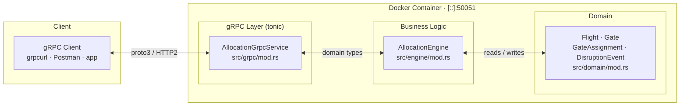
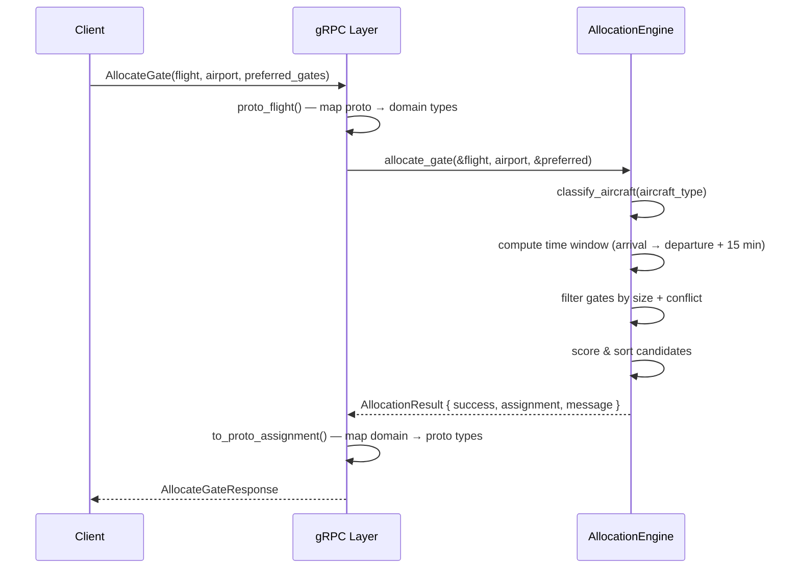
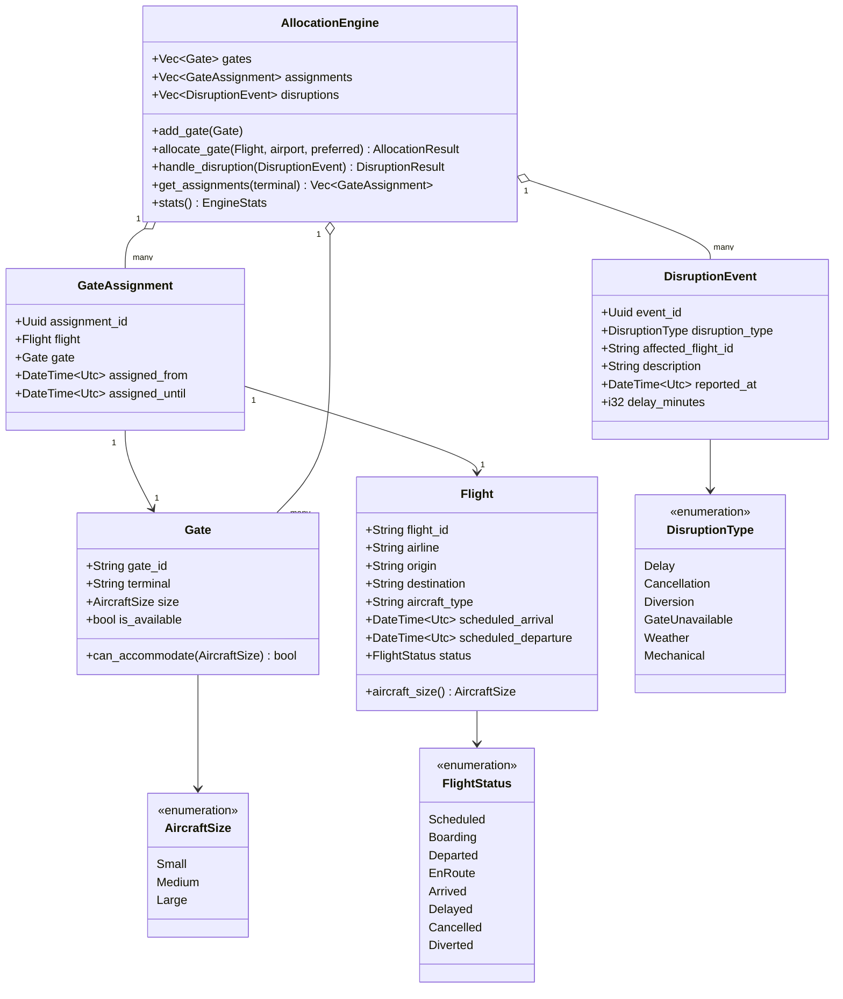
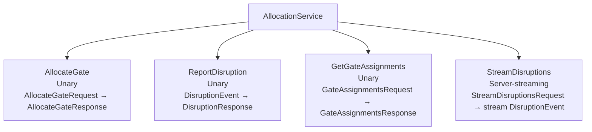
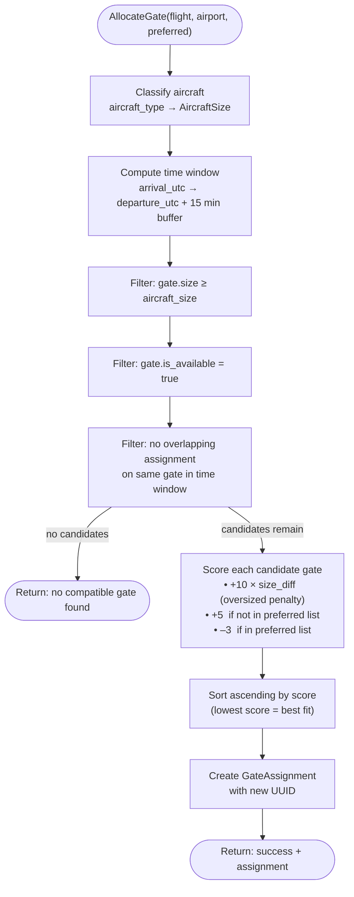
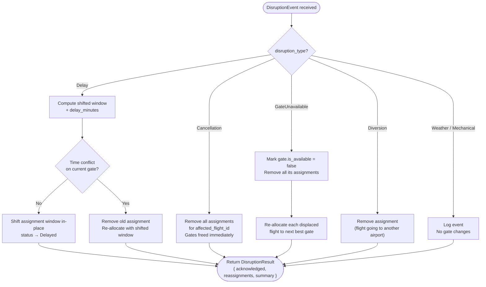
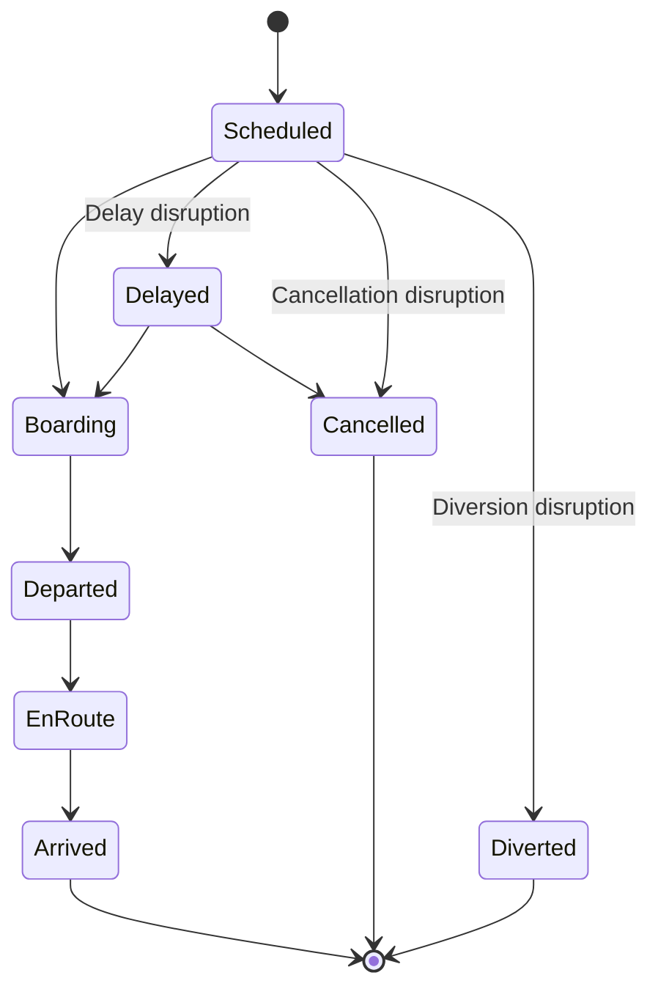
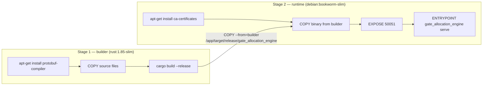
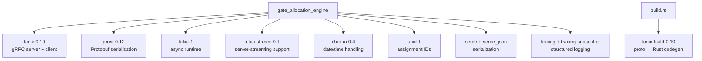

# Gate Allocation Engine

**Aviation Gate Allocation & Disruption Optimisation Engine**

A Rust gRPC service that models real-time gate allocation, constraint-based
optimisation, and disruption recovery for airport operations. Built with
`tonic`, `prost`, and `tokio`.

---

## Table of Contents

- [Architecture](#architecture)
- [Domain Model](#domain-model)
- [gRPC API](#grpc-api)
- [Allocation Algorithm](#allocation-algorithm)
- [Disruption Handling](#disruption-handling)
- [Project Structure](#project-structure)
- [Getting Started](#getting-started)
- [Testing](#testing)
- [Docker](#docker)
- [Tech Stack](#tech-stack)
- [Ideas for Extension](#ideas-for-extension)

---

## Architecture

The service is structured in three layers: a thin gRPC transport layer, a
pure-Rust allocation engine, and an immutable domain model. The engine holds
no I/O dependencies, making it trivially testable and portable to a persistent
backend.



A typical `AllocateGate` call flows as follows:



---

## Domain Model



### Aircraft size classification

Aircraft type strings are mapped to gate size requirements at allocation time:

| Size | Types |
|---|---|
| **Large** | A350, A380, A330, A340, B747, B777, B787 |
| **Medium** | A320, B737, and all other types (default) |
| **Small** | E190, E195, ATR72, ATR42, CRJ900, CRJ700 |

Gates are sized `Small ≤ Medium ≤ Large` — a Large gate can accommodate any
aircraft, a Small gate only Small aircraft.

---

## gRPC API

The service is defined in [`proto/allocation.proto`](proto/allocation.proto).



| RPC | Direction | Purpose |
|---|---|---|
| `AllocateGate` | Unary | Allocate or re-allocate a gate for a flight |
| `ReportDisruption` | Unary | Submit a disruption event; triggers automatic re-allocation |
| `GetGateAssignments` | Unary | Query current assignments, optionally filtered by terminal |
| `StreamDisruptions` | Server-streaming | Live feed of disruption events (stub — ready for implementation) |

---

## Allocation Algorithm

The engine uses a **constraint-based scoring heuristic** — no external solver
dependency, runs in microseconds per request.



### Scoring summary

| Condition | Score delta |
|---|---|
| Gate one size larger than needed | +10 |
| Gate two sizes larger than needed | +20 |
| Gate not in preferred list | +5 |
| Gate in preferred list | −3 |

Lower total score wins. The preferred-gate reward is intentionally small so
that a well-matched non-preferred gate still beats an oversized preferred one.

---

## Disruption Handling

`ReportDisruption` accepts a `DisruptionEvent` and mutates the engine state
according to the disruption type.



### Flight status transitions



---

## Project Structure

```
gate_allocation_engine/
├── Cargo.toml                  # Dependencies and project metadata
├── Cargo.lock                  # Pinned dependency versions (gitignored)
├── build.rs                    # Runs tonic-build to compile proto → Rust
├── Dockerfile                  # Multi-stage build (rust:1.85-slim → debian:bookworm-slim)
├── proto/
│   └── allocation.proto        # gRPC service + message definitions
├── src/
│   ├── main.rs                 # Entry point: 'demo' and 'serve' modes
│   ├── domain/
│   │   └── mod.rs              # Pure domain types: Flight, Gate, GateAssignment, etc.
│   ├── engine/
│   │   └── mod.rs              # AllocationEngine: constraint solver + disruption handler
│   └── grpc/
│       └── mod.rs              # tonic service impl + proto ↔ domain type mapping
└── test/
    └── grpcurl/                # Ready-to-use request fixtures for grpcurl
        ├── allocate_gate.json
        ├── get_gate_assignments.json
        ├── get_gate_assignments_t5.json
        ├── report_disruption_cancellation.json
        ├── report_disruption_delay.json
        ├── report_disruption_gate_unavailable.json
        └── stream_disruptions.json
```

---

## Getting Started

### Prerequisites

#### 1. Rust (via rustup)

```
# Windows — download and run the installer
https://rustup.rs/
```

The installer requires the **Microsoft C++ Build Tools**. If not already
present, select the **"Desktop development with C++"** workload from
https://visualstudio.microsoft.com/visual-cpp-build-tools/

Verify in a new terminal:
```
rustc --version   # 1.85+
cargo --version
```

#### 2. Protocol Buffers compiler

Required by `build.rs` to compile `allocation.proto` at build time.

```
# Chocolatey
choco install protoc

# winget
winget install Google.Protobuf
```

Or download `protoc-XX.X-win64.zip` from
https://github.com/protocolbuffers/protobuf/releases, extract, and add the
`bin/` folder to your `PATH`.

Verify:
```
protoc --version
```

#### 3. IDE

**VS Code + rust-analyzer** is recommended:

1. Install [VS Code](https://code.visualstudio.com/)
2. Install the **rust-analyzer** extension
3. Optional: **Even Better TOML**, **crates**, **CodeLLDB**

Alternatively: **JetBrains RustRover** (free for non-commercial use).

---

### Build

```bash
cargo build
```

The first build downloads and compiles ~170 crates. Subsequent builds are
incremental.

### Run the demo simulation

```bash
cargo run -- demo
```

Simulates a morning at LHR:

1. Registers 10 gates across T5 and T2
2. Allocates gates for 8 scheduled flights using the optimisation engine
3. Injects 3 disruption scenarios (delay, cancellation, gate failure)
4. Prints the final gate assignment state

### Run the gRPC server

```bash
cargo run -- serve
```

Starts the gRPC server on `[::]:50051`, listening on all interfaces.

### Enable verbose logging

```bash
RUST_LOG=debug cargo run -- demo
```

---

## Testing

### Unit tests

```bash
cargo test
```

Five tests in `src/engine/mod.rs`:

| Test | What it covers |
|---|---|
| `allocates_right_sized_gate` | Prefers exact-fit gate over oversized |
| `rejects_undersized_gate` | Rejects gate too small for the aircraft |
| `detects_time_conflicts` | Blocks double-booking of the same gate |
| `cancellation_frees_gate` | Gate becomes available after cancellation |
| `prefers_requested_gate` | Scoring rewards preferred gate selection |

### gRPC integration tests with grpcurl

Seven request fixtures live in `test/grpcurl/`. Run them against a live server
to exercise every RPC end-to-end.

#### Install grpcurl

```bash
# macOS
brew install grpcurl

# Windows (winget)
winget install fullstorydev.grpcurl

# Windows (Chocolatey)
choco install grpcurl

# Direct download — pre-built binaries for all platforms
# https://github.com/fullstorydev/grpcurl/releases
```

Verify: `grpcurl --version`

#### Start the server

Run natively or via Docker — the test commands are identical either way.

```bash
# Native
cargo run -- serve

# Docker (build once, run any time)
docker build -t gate-allocation-engine .
docker run -d --name gate-alloc -p 50051:50051 gate-allocation-engine
docker logs gate-alloc   # confirm "Listening on [::]:50051"
```

#### Test sequence

> **Note:** the server is stateful and in-memory. The calls below build on each
> other — run them in order for a complete scenario. Restarting the server
> resets all state.

All commands are run from the project root.

**1. Allocate a gate — `AllocateGate`**

Requests a Large gate for a B777, with T5-A1 and T5-A2 as preferred gates.

```bash
grpcurl -plaintext -proto proto/allocation.proto \
  -d @ localhost:50051 allocation.AllocationService/AllocateGate \
  < test/grpcurl/allocate_gate.json
```

Expected: `success: true`, flight assigned to `T5-A1` with `score: -3.0`
(preferred gate reward applied).

**2. Report a delay — `ReportDisruption`**

Delays the allocated flight (BA-001) by 45 minutes.

```bash
grpcurl -plaintext -proto proto/allocation.proto \
  -d @ localhost:50051 allocation.AllocationService/ReportDisruption \
  < test/grpcurl/report_disruption_delay.json
```

Expected: `acknowledged: true`, assignment window shifted forward 45 minutes,
flight status updated to `DELAYED`. No re-allocation needed if the gate is
still free after the shift.

**3. Query all assignments — `GetGateAssignments`**

```bash
grpcurl -plaintext -proto proto/allocation.proto \
  -d @ localhost:50051 allocation.AllocationService/GetGateAssignments \
  < test/grpcurl/get_gate_assignments.json
```

Expected: the single delayed assignment with updated `assigned_from_utc` /
`assigned_until_utc` timestamps.

**4. Query by terminal — `GetGateAssignments` (T5 filter)**

```bash
grpcurl -plaintext -proto proto/allocation.proto \
  -d @ localhost:50051 allocation.AllocationService/GetGateAssignments \
  < test/grpcurl/get_gate_assignments_t5.json
```

Expected: same result as above (the assignment is in T5). An empty terminal
field in the request returns all terminals.

**5. Take a gate offline — `ReportDisruption` (GateUnavailable)**

Marks T5-A1 as unavailable. Any flights assigned to it are automatically
re-allocated to the next best gate.

```bash
grpcurl -plaintext -proto proto/allocation.proto \
  -d @ localhost:50051 allocation.AllocationService/ReportDisruption \
  < test/grpcurl/report_disruption_gate_unavailable.json
```

Expected: `acknowledged: true`, BA-001 re-allocated to `T5-A2` (next available
Large gate), new `assignment_id` issued.

> **Note:** for `GateUnavailable` events the `description` field carries the
> gate ID to take offline (e.g. `"T5-A1"`). `affected_flight` can be left
> blank — the engine looks up all flights at that gate automatically.

**6. Cancel a flight — `ReportDisruption` (Cancellation)**

```bash
grpcurl -plaintext -proto proto/allocation.proto \
  -d @ localhost:50051 allocation.AllocationService/ReportDisruption \
  < test/grpcurl/report_disruption_cancellation.json
```

Expected: `acknowledged: true`, summary confirms gate freed
(`"BA-001 cancelled - 1 gate(s) freed"`). A subsequent `GetGateAssignments`
call will return an empty list.

**7. Live disruption stream — `StreamDisruptions`**

```bash
grpcurl -plaintext -proto proto/allocation.proto \
  -d @ localhost:50051 allocation.AllocationService/StreamDisruptions \
  < test/grpcurl/stream_disruptions.json
```

Expected: the stream opens and closes immediately with no events — this RPC is
a documented stub ready for a `broadcast::Sender` implementation (see
[Ideas for Extension](#ideas-for-extension)).

#### Clean up

```bash
docker rm -f gate-alloc
```

---

## Docker

The Dockerfile uses a two-stage build: a `rust:1.85-slim` builder that
compiles the release binary (including protobuf compilation), copied into a
minimal `debian:bookworm-slim` runtime image.



```bash
# Build
docker build -t gate-allocation-engine .

# Run
docker run -d --name gate-alloc -p 50051:50051 gate-allocation-engine

# Check logs
docker logs gate-alloc

# Stop and remove
docker rm -f gate-alloc
```

---

## Tech Stack

| Requirement | Implementation |
|---|---|
| Rust backend services | Entire project is Rust (edition 2021) |
| gRPC / Protobuf | `tonic` 0.10 + `prost` 0.12 with proto3 service definitions |
| Real-time optimisation engine | Constraint-based gate allocation with scoring heuristic |
| System modelling / optimisation | Aircraft size constraints, time-window conflict detection, disruption recovery |
| Observability | `tracing` + `tracing-subscriber` structured logging with env-filter |
| Docker | Multi-stage Dockerfile; ~90 MB runtime image |
| Domain model | Designed for a Postgres backend via `sqlx` (in-memory for this demo) |

### Dependency overview



---

## Ideas for Extension

- **Postgres persistence** — add `sqlx` and migrations; the domain model maps
  directly to relational tables
- **Streaming disruptions** — implement `StreamDisruptions` with a
  `tokio::sync::broadcast` channel so subscribers receive live events
- **Prometheus metrics** — instrument allocation latency, disruption counts,
  and gate utilisation with the `metrics` crate
- **Weighted scoring** — add walking distance, gate adjacency, and airline
  tier preferences to the scoring function
- **Multi-objective optimisation** — minimise total passenger walking distance
  while maximising gate utilisation
- **Flutter / Dart client** — mobile operations dashboard calling the gRPC API
- **React / TypeScript dashboard** — real-time gate map using gRPC-Web
- **Arrow / Parquet export** — dump assignment history for analytics pipelines

---

## Useful Commands

```bash
cargo check           # Fast type-check without full compilation
cargo clippy          # Lint for idiomatic Rust
cargo fmt             # Auto-format all source files
cargo doc --open      # Generate and open API documentation
cargo build --release # Optimised production build
```
